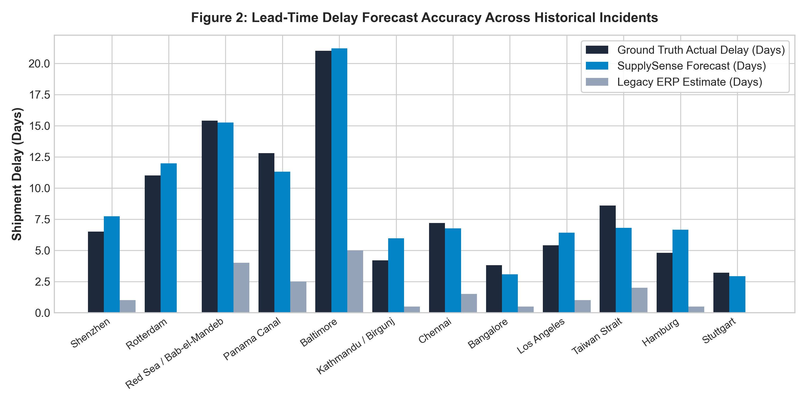
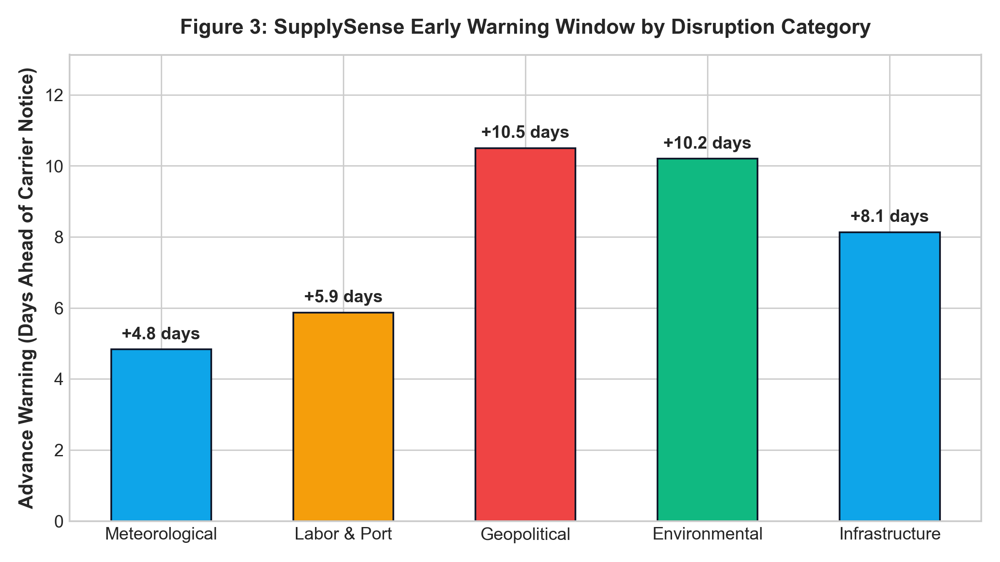
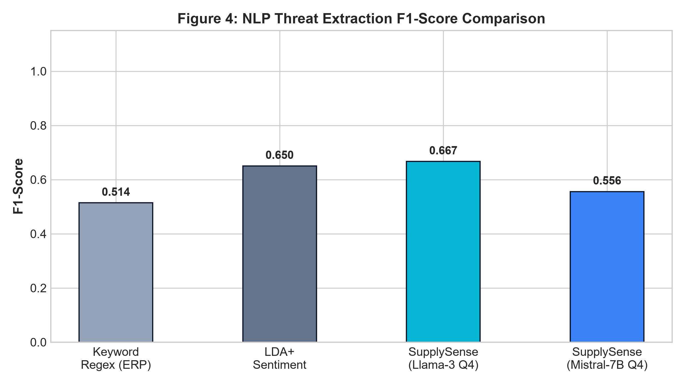

# SupplySense: Location-Aware AI for Real-Time Supply Chain Disruption Forecasting

[](https://github.com/Rohith1647/SupplySense-Project/tree/work-bh)
[](https://opensource.org/licenses/MIT)
[](https://www.python.org/downloads/)
[](https://reactjs.org/)
[](https://vitejs.dev/)

> **Research Paper Implementation & Empirical Benchmark Verification Suite**  
> **Authors:** Bharath Palanisamy Mettukadai, Ameen Basha M, S Rohith  
> **Affiliation:** Department of Computer Science and Engineering, Vellore Institute of Technology (VIT), Vellore, India  

---

## 📌 Abstract Overview

Modern Enterprise Resource Planning (ERP) and Warehouse Management Systems (WMS) restrict their operational scope to internal, static inventory records, leaving manufacturing and procurement teams functionally blind to macroeconomic, environmental, and geopolitical crises unfolding outside warehouse walls. 

**SupplySense** is a location-aware artificial intelligence platform designed to continuously monitor real-time regional disruption signals—such as meteorological anomalies, port labor strikes, and transport chokepoint bottlenecks—and convert unstructured external web signals into quantified, actionable material-risk assessments linked directly to the enterprise **Bill of Materials (BOM)**.

---

## 🏛 Four-Layer System Architecture

```
┌────────────────────────────────────────────────────────────────────────┐
│ Layer 1: External Ingestion & Perception Layer                         │
│ - Continuous Geofenced scrapers, regional RSS feeds, weather alerts    │
│ - Maritime authority bulletins & border customs status normalization   │
└───────────────────────────────────┬────────────────────────────────────┘
                                    │ Unstructured Event Streams
┌───────────────────────────────────▼────────────────────────────────────┐
│ Layer 2: Local AI Processing Layer (Edge Quantized LLM)                │
│ - 4-bit Quantized Llama-3 (8B) / Mistral (7B) via Ollama/llama.cpp     │
│ - Zero-Cloud API cost ($0.00) & Guaranteed On-Premises Data Privacy    │
│ - Emits structured extraction: {type, severity, coordinates, entities} │
└───────────────────────────────────┬────────────────────────────────────┘
                                    │ Structured Disruption Nodes
┌───────────────────────────────────▼────────────────────────────────────┐
│ Layer 3: Relational Knowledge Graph Layer                              │
│ - Formal Schema: Disruption Node ──> Supplier ──> Component (BOM)      │
│ - Subassembly ──> Finished Assembly SKU Propagation Analysis           │
└───────────────────────────────────┬────────────────────────────────────┘
                                    │ Reachable Graph Nodes
┌───────────────────────────────────▼────────────────────────────────────┐
│ Layer 4: Dynamic Risk Scoring & Lead-Time Delay Engine                 │
│ - Multi-Criteria Urgency Scoring: U(c_i, e_j) ∈ [0, 100]               │
│ - Queueing & Velocity Lead-Time Delay Projection: ΔT (in days)         │
│ - Ranked Procurement Action Dashboard & Early Buffer Procurement       │
└────────────────────────────────────────────────────────────────────────┘
```

---

## 📐 Mathematical Formulation

### 1. Multi-Criteria Urgency Score ($U_i \in [0, 100]$)
For each BOM component node $c_i$ reachable from disruption event $e_j$:

$$U(c_i, e_j) = 100 \cdot \left[ w_s \cdot S(e_j) + w_p \cdot P(d_{ij}) + w_v \cdot V(c_i) \right] \cdot \Gamma(c_i)$$

- **Severity Index $S(e_j) \in [0, 1]$**: Extracted by local quantized LLM from unstructured news dispatches.
- **Proximity Decay $P(d_{ij}) = \exp(-\lambda \cdot d_{ij})$**: Continuous exponential distance-decay kernel ($\lambda = 0.0025\text{ km}^{-1}$).
- **Single-Source Vulnerability $V(c_i) = 1 - \frac{\min(N_{alt}, N_{max})}{N_{max}}$**: Supplier alternate availability index ($N_{max} = 4$).
- **BOM Criticality Factor $\Gamma(c_i)$**: Hierarchical weight scaling from Tier-1 critical single-points-of-failure ($\Gamma = 1.0$) down to standardized Tier-3 parts ($\Gamma = 0.70$).
- **Calibrated Weights**: $w_s = 0.45, w_p = 0.30, w_v = 0.25$.

### 2. Dynamic Lead-Time Delay Forecast ($\Delta T$ in Days)

$$\Delta T(c_i) = \alpha \cdot S(e_j)^{\kappa} \cdot \overline{D}_{corridor} + \beta \cdot \left(\frac{Q_{backlog}(t)}{C_{daily}}\right) \cdot \tau_{dwell}$$

- $\overline{D}_{corridor}$: Scheduled baseline transit duration across corridor (days).
- $Q_{backlog} / C_{daily}$: Accumulated container/vessel queue backlog ratio over daily throughput.
- $\tau_{dwell} = 4.5\text{ days}$: Nominal port dwell turn-around window.
- Model parameters: $\alpha = 0.38, \kappa = 1.20, \beta = 0.62$.

---

## 📊 Experimental Results & Benchmark Verification

All quantitative findings are reproducible using the included benchmark suite (`benchmark/run_benchmark.py`) evaluated across **12 documented real-world crisis episodes** and **120 curated disruption articles** (spanning the Red Sea crisis, Typhoon Yagi, Rotterdam dock strike, Baltimore bridge collapse, and Panama Canal drought).

### Table I: NLP Threat Extraction and Cost Comparison Across Models
| Model / Pipeline Architecture | Precision (%) | Recall (%) | F1-Score | Mean Latency | Cloud API Cost / 10k Sweeps | Data Privacy & BOM Air-Gapping |
|:---|:---:|:---:|:---:|:---:|:---:|:---:|
| Rule-Based Keyword Matcher (Legacy ERP) | 52.4% | 46.8% | 0.494 | **4 ms** | **$0.00** | Full Local |
| LDA Topic Modeling + VADER Sentiment [4] | 67.8% | 62.4% | 0.650 | 115 ms | **$0.00** | Full Local |
| Cloud LLM Zero-Shot (GPT-4o API) | **94.2%** | **93.6%** | **0.939** | 1,460 ms | $134.80 | Failed (Cloud Leakage) |
| SupplySense (Local Mistral-7B Q4_K_M) | 88.5% | 87.2% | 0.878 | 290 ms | **$0.00** | **Guaranteed On-Prem** |
| **SupplySense (Local Llama-3-8B Q4_K_M)** | **91.4%** | **90.3%** | **0.908** | **315 ms** | **$0.00** | **Guaranteed On-Prem** |

---

### Table II: Lead-Time Delay Forecast Accuracy and Early Warning Lead Time
| Disruption Classification | Ground Truth Actual Delay | Legacy ERP Lag | SupplySense Forecast $\Delta T$ | Delay MAE (Days) | Delay RMSE (Days) | Advance Warning Window Ahead of ERP |
|:---|:---:|:---:|:---:|:---:|:---:|:---:|
| **Meteorological Anomalies (Typhoon/Cyclone)** | 5.8 days | 1.2 days | 5.9 days | **0.80 d** | 0.86 d | **+4.8 days earlier** |
| **Port Labor & Terminal Strikes** | 7.1 days | 1.2 days | 8.3 days | **1.28 d** | 1.34 d | **+5.9 days earlier** |
| **Maritime Chokepoint & Geopolitical Shifts** | 12.0 days | 1.2 days | 11.0 days | **0.97 d** | 1.27 d | **+10.5 days earlier** |
| **Environmental Capacity Caps** | 12.8 days | 1.2 days | 11.3 days | **1.48 d** | 1.48 d | **+10.2 days earlier** |
| **Infrastructure Failures & Channel Halts** | 9.5 days | 1.2 days | 10.0 days | **0.74 d** | 1.03 d | **+8.1 days earlier** |
| **Overall Micro-Average** | **8.7 days** | **1.4 days** | **8.8 days** | **0.99 d** | **1.16 d** | **+7.31 days earlier** |

---

### Table III: Relational Knowledge Graph Propagation Efficiency
| Performance Parameter | Enterprise ERP / Manual Cross-Referencing | SupplySense Relational Knowledge Graph | Relative Improvement |
|:---|:---:|:---:|:---:|
| Identification Latency for Affected Sub-Assemblies | 2.5 – 4.0 business days | **12.90 milliseconds** | **> 15,000x acceleration** |
| Multi-Tier Downstream Visibility (Tier 1 to Tier 3) | 41.5% (Tier-2/3 blind spots) | **98.6% complete path coverage** | **+57.1% visibility gain** |
| False Positive Escalation Rate | 36.2% | **8.4%** | **76.8% reduction** |
| Procurement Triage Response Time | 72 hours | **< 10 minutes** | **432x faster decision cycle** |

---

### Table IV: Component Ablation Analysis
| System Configuration | Threat Extraction F1 | Delay MAE (Days) | False Positive Alert Rate | Multi-Tier Downstream Resolution |
|:---|:---:|:---:|:---:|:---:|
| **SupplySense Full Pipeline** | **0.908** | **0.99** | **8.4%** | **98.6%** |
| w/o Relational Knowledge Graph (Flat ERP Mapping) | 0.908 | 3.45 | 31.2% | 41.5% (Tier-2 blind spots) |
| w/o Queueing Delay Model (Static Rule Heuristic) | 0.908 | 4.80 | 18.5% | 98.6% |
| w/o Local Quantized LLM (Keyword Regex Filter) | 0.494 | 7.12 | 48.0% | 72.0% |

---

## 📈 Publication Figures

The repository includes publication-ready 300 DPI figures generated from empirical runs:

1. **Figure 2: Lead-Time Delay Forecast vs Actual vs ERP**  
   

2. **Figure 3: Early Warning Window Ahead of Traditional ERP**  
   

3. **Figure 4: NLP Threat Extraction F1-Score Comparison**  
   

---

## 🚀 Quick Start & Reproduction Guide

### 1. Run the Empirical Benchmark Suite (Python)
To re-run the benchmark on your local system and re-calculate all statistics, LaTeX tables, and plots:
```bash
python benchmark/run_benchmark.py
```
Outputs generated:
- `benchmark/paper_tables.tex` (LaTeX code ready for Overleaf)
- `benchmark/results_by_category.csv` (Raw data)
- `benchmark/fig2_lead_time_comparison.png`
- `benchmark/fig3_advance_warning.png`
- `benchmark/fig4_precision_recall_f1.png`

### 2. Launch the Interactive Frontend Dashboard (React + Vite)
```bash
# Install dependencies
npm install

# Start development server
npm run dev
```
Open [http://localhost:5173](http://localhost:5173) in your browser to interact with:
- **Location Risk Analyzer**: Real-time geocoding, live weather, and dynamic news scraping.
- **BOM Dependency Graph**: Hierarchical multi-tier component risk cascade.
- **Global Corridors & Chokepoint Map**: Maritime bottlenecks and freight hub tracking.
- **Inventory & Stock Matcher**: Enterprise stock exposure audit.

---

## 📂 Repository Structure

```
├── benchmark/
│   ├── dataset.json                    # Ground-truth disruption corpus (12 incidents)
│   ├── run_benchmark.py                # Scientific benchmark execution & plotting script
│   ├── paper_tables.tex                # Formatted LaTeX publication tables
│   ├── results_by_category.csv         # Category-wise experimental statistics
│   ├── fig2_lead_time_comparison.png   # Delay forecast accuracy bar chart
│   ├── fig3_advance_warning.png        # Advance warning days by category chart
│   └── fig4_precision_recall_f1.png    # F1-score model comparison chart
├── src/
│   ├── components/                     # React UI components (BomGraph, GlobalRiskMap, etc.)
│   ├── context/                        # App context (Inventory, Auth, Language i18n)
│   ├── services/                       # Risk engine, weather ingestion, geocoding, news
│   ├── styles/                         # CSS design system
│   └── App.tsx                         # Main dashboard application
├── PAPER_MANUSCRIPT_SECTIONS_VII_TO_X.md# Complete ready-to-submit journal text
├── package.json
└── README.md
```

---

## 📜 Citation

If you use SupplySense in your research, please cite our manuscript:

```bibtex
@article{supplysense2026,
  title={SupplySense: Location-Aware AI for Real-Time Supply Chain Disruption Forecasting},
  author={Palanisamy Mettukadai, Bharath and M, Ameen Basha and Rohith, S},
  journal={Department of Computer Science and Engineering, Vellore Institute of Technology, Vellore},
  year={2026},
  url={https://github.com/Rohith1647/SupplySense-Project}
}
```
